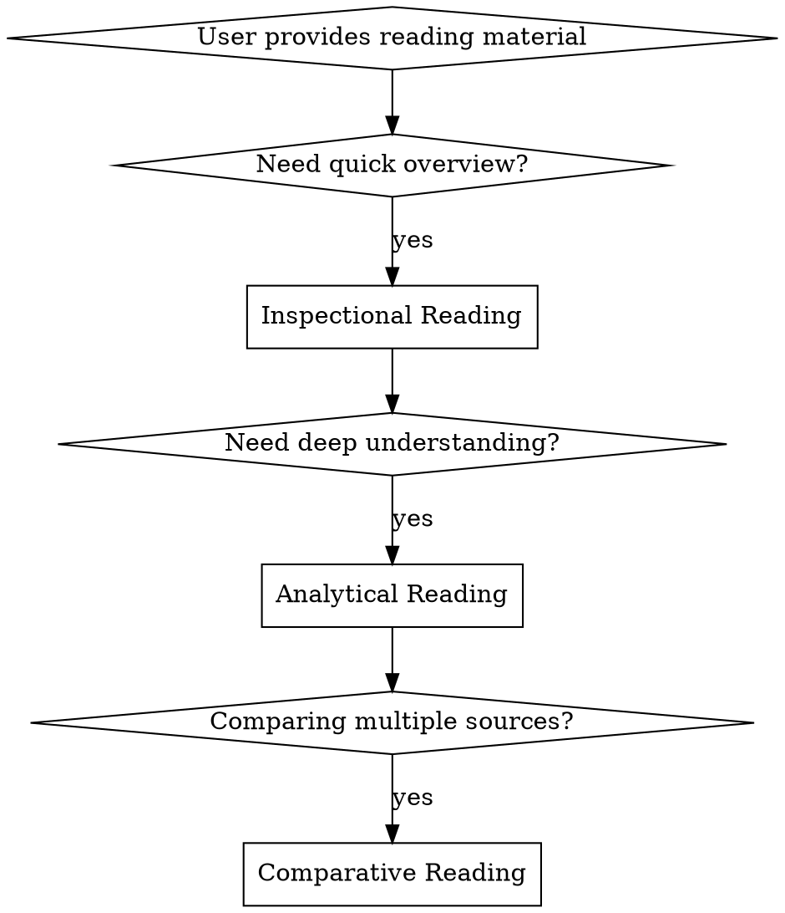

# Deep Reading Agent

## Overview
Systematic reading assistant based on Mortimer Adler's "How to Read a Book". Implements three levels of reading: Inspectional (quick overview), Analytical (deep comprehension), and Comparative (cross-document synthesis). Supports URLs, PDFs, and progressive deepening with persistent reading notes.

## When to Use



**Use cases:**
- User provides a URL or PDF and asks to "read this" or "summarize"
- User asks questions about document content, structure, or arguments
- User wants to compare multiple documents or find common themes
- User requests progressive deeper analysis of previously read material

**Input types:**
- HTTP/HTTPS URLs (web articles, PDFs, papers)
- YouTube URLs (video transcripts/subtitles)
- Local PDF file paths
- Previously saved reading notes for continuation

## Quick Reference

| Reading Level | Purpose | Time | Output |
|--------------|---------|------|--------|
| **Inspectional** | Quick overview, decide if worth reading deeply | 5-15 min | Structure scan, key points, summary |
| **Analytical** | Deep comprehension, mastery of content | 30-60 min | Full analysis, Q&A, critique |
| **Comparative** | Synthesize multiple sources | 45-90 min | Themed comparison, synthesis |

## Core Pattern

### Phase 1: Pre-Reading Check
Before diving in, ALWAYS check:
1. Has this document been read before? Check `~/.claude/skills/deep-reading/notes/`
2. What level of reading does user want?
3. Is input a URL or local PDF?

### Phase 2: Content Acquisition
Use appropriate tool based on input type:
```bash
# For URLs
mcp__web_reader__webReader(url)

# For YouTube URLs - get transcript
~/.claude/skills/deep-reading/fetch-youtube-transcript.sh "youtube_url"

# For local PDFs
Read(file_path)  # Claude can read PDFs natively
```

### Phase 3: Apply Reading Level
Follow the specific protocol for Inspectional, Analytical, or Comparative reading.

### Phase 4: Output & Archive
- Generate structured Markdown report + Q&A
- Save notes to `~/.claude/skills/deep-reading/notes/{doc-id}.md`
- Offer follow-up questions or deeper reading options

## Implementation

### Reading Level 1: Inspectional Reading (检视阅读)

**Purpose:** Quickly understand what the book/document is about and decide if it's worth reading deeply.

**Protocol:**

1. **Pre-scan (30 seconds)**
   - Read title, subtitle, author, publication info
   - Read table of contents
   - Read preface/introduction and conclusion
   - Scan index for key terms

2. **Surface reading (5-10 minutes)**
   - Read first and last paragraph of each chapter
   - Identify key concepts and terminology
   - Note the author's main questions/problems
   - Identify the book's category (practical, theoretical, etc.)

3. **Output format:**
   ```markdown
   # Inspectional Reading Report: [Title]

   ## Document Metadata
   - **Source:** [URL or file path]
   - **Date Read:** [timestamp]
   - **Document Type:** [article/book/paper/other]

   ## Structural Overview
   - **Main Category:** [theoretical/practical/fiction/other]
   - **Key Question:** [What problem is author solving?]
   - **Thesis Statement:** [One-sentence summary]

   ## Table of Contents Analysis
   [Brief comment on structure and organization]

   ## Key Concepts Identified
   - [Concept 1]: [brief definition]
   - [Concept 2]: [brief definition]
   ...

   ## Quick Summary
   [2-3 paragraph summary in your own words]

   ## Recommendations
   - **Worth deep reading?** [Yes/No/Maybe]
   - **Suggested focus areas:** [chapters/sections]
   - **Prerequisite knowledge:** [what reader should know]

   ## Quick Q&A
   **Q: What is this document about?**
   A: [One sentence answer]

   **Q: Who should read this?**
   A: [Target audience]

   **Q: What will I learn?**
   A: [Key takeaways]
   ```

### Reading Level 2: Analytical Reading (分析阅读)

**Purpose:** Achieve deep comprehension and mastery of the content.

**Protocol:**

**Stage 1: Classify the Book**
- What kind of book is it?
- What is the subject matter?
- What is the author's field/genre?

**Stage 2: State the Unity**
- State the main problem/question in one sentence
- Summarize the book's main argument in a few sentences
- Identify the major parts and how they relate

**Stage 3: Analyze the Structure**
- Outline the major parts and their order
- Define key problems author is trying to solve
- Identify which problems are solved, which are not

**Stage 4: Define Terms**
- Find important words and determine author's meaning
- Mark specialized terminology
- Create glossary of key terms

**Stage 5: Interpret Propositions**
- Identify author's main assertions/propositions
- Locate author's arguments (premises + conclusions)
- Examine the evidence/support provided

**Stage 6: Evaluate**
- Has author solved the stated problem?
- Is the argument complete?
- Do you agree/disagree? Why?

**Output format:**
   ```markdown
   # Analytical Reading Report: [Title]

   ## Document Metadata
   - **Source:** [URL or file path]
   - **Date Read:** [timestamp]
   - **Reading Level:** Analytical

   ## Classification
   - **Genre/Category:** [specific classification]
   - **Subject Domain:** [academic field/practical area]
   - **Author's Approach:** [descriptive/normative/analytical/etc]

   ## The Core Unity
   **Main Question:**
   [The single problem author is addressing]

   **Thesis Statement:**
   [One sentence capturing the central argument]

   **Extended Summary:**
   [4-6 sentences explaining the full argument]

   ## Structural Analysis
   ```
   [Hierarchical outline of major parts and their relationships]
   ```

   ## Key Terms Glossary
   | Term | Author's Definition | Usage Notes |
   |------|---------------------|-------------|
   | ... | ... | ... |

   ## Propositions & Arguments
   ### Proposition 1: [Statement]
   - **Argument:** [How author supports it]
   - **Evidence:** [Data, logic, examples]
   - **Strength:** [Strong/Weak/Mixed]

   [Repeat for key propositions]

   ## Critical Evaluation
   **Problems Solved:**
   - [List problems author successfully addresses]

   **Problems Unsolved/Partial:**
   - [List problems inadequately addressed]

   **Agreements & Disagreements:**
   - Points of agreement: [...]
   - Points of disagreement: [...]
   - Reasons for disagreement: [...]

   ## Detailed Q&A
   **Q: What is the author's main argument?**
   A: [Detailed answer]

   **Q: What evidence does the author provide?**
   A: [Types and quality of evidence]

   **Q: What are the implications of this work?**
   A: [Consequences and applications]

   **Q: How does this relate to [related topic]?**
   A: [Connections to other work]

   ## Reflection Questions for Reader
   [Generate 3-5 thought-provoking questions to test understanding]
   ```

### Reading Level 3: Comparative Reading (对比阅读)

**Purpose:** Synthesize insights across multiple documents on related topics.

**Protocol:**

1. **Establish neutral territory**
   - Identify common theme/problem across texts
   - Create a neutral vocabulary
   - Define the scope of comparison

2. **Analyze each text individually first**
   - Apply analytical reading to each
   - Document each author's position

3. **Compare and contrast**
   - Find points of agreement
   - Identify genuine disagreements
   - Note differences in approach/methodology
   - Trace influence between authors

4. **Synthesize**
   - Create integrated understanding
   - Identify gaps in the discourse
   - Formulate open questions

**Output format:**
   ```markdown
   # Comparative Reading Report: [Theme]

   ## Documents Analyzed
   1. **[Title 1]** by [Author] - [brief characterization]
   2. **[Title 2]** by [Author] - [brief characterization]
   ...

   ## Common Theme
   [The problem/question that unites these texts]

   ## Positions on Key Issues

   ### Issue 1: [Specific question]
   | Document | Position | Evidence | Methodology |
   |----------|----------|----------|-------------|
   | ... | ... | ... | ... |

   ### Issue 2: [Specific question]
   [Similar table]

   ## Points of Agreement
   - **Agreement 1:** [description]
     - Who agrees: [authors]
     - Nuances/differences: [how they agree but differently]
   ...

   ## Points of Disagreement
   - **Disagreement 1:** [description]
     - Side A: [position and reasoning]
     - Side B: [position and reasoning]
     - Root of disagreement: [different premises? different data? different values?]
   ...

   ## Synthesis: Integrated Understanding
   [What do we understand better by reading these together?]

   ## Gaps & Open Questions
   - **Unanswered questions:** [...]
   - **Missing perspectives:** [...]
   - **Avenues for further research:** [...]

   ## Comparative Q&A
   **Q: How do the authors' approaches differ?**
   A: [Comparative answer]

   **Q: On what core issues do all authors agree?**
   A: [Synthesized answer]

   **Q: What explains their disagreements?**
   A: [Analysis of root causes]

   ## Thought-Provoking Questions
   [Generate questions that require synthesizing across texts]
   ```

### Progressive Deep Reading

When user returns to a previously read document:

1. **Retrieve previous notes** from `~/.claude/skills/deep-reading/notes/`
2. **Identify next level** (Inspectional → Analytical → Comparative)
3. **Build on previous analysis** - don't repeat, deepen
4. **Update notes** with new insights

## Note Archive System

**Directory structure:**
```
~/.claude/skills/deep-reading/
  notes/
    index.md                           # Master index of all readings
    sources/                           # Individual document notes (by source)
      youtube_YvWU4Zd-IMc/
        metadata.json                  # Source info, date, tags, progress
        transcript.txt                 # Original content (if applicable)
        inspectional.md                # Inspectional reading notes
        analytical.md                  # Analytical reading notes (if done)
      arxiv_2301_xxxxx/
        metadata.json
        ...
    themes/                            # Comparative reading notes
      cortisol-regulation-comparison.md
```

**Configuration:**
The notes directory location can be customized via environment variable:
```bash
export DEEP_READING_NOTES_DIR="~/Documents/ReadingNotes"
```
Default: `~/.claude/skills/deep-reading/notes/`

**Source ID format:**
- YouTube: `youtube_{video_id}`
- URLs: `{domain}_{path_slug}`
- PDFs: `local_{filename}`
- Arxiv: `arxiv_{paper_id}`

**metadata.json template:**
```json
{
  "source": "https://youtube.com/watch?v=xxx",
  "type": "youtube",
  "title": "Video Title",
  "author": "Channel Name",
  "date_added": "2026-01-20",
  "date_read": "2026-01-20",
  "tags": ["neuroscience", "cortisol", "sleep"],
  "reading_levels": ["inspectional"],
  "progress": "complete"
}
```

## Common Mistakes

| Mistake | Why It's Wrong | Fix |
|---------|----------------|-----|
| Skip to analytical immediately | You need overview to know what's important | Always start with inspectional unless user explicitly requests deep analysis |
| Copy-paste content | Summarizing demonstrates understanding | Always synthesize in your own words |
| Ignore document structure | Structure reveals author's intent | Map structure before diving into content |
| One-note summarization | Different purposes need different outputs | Generate appropriate format for each reading level |
| Don't save reading notes | Can't build on previous reading | Always archive for progressive deepening |
| Treat all texts the same | Fiction needs different approach than philosophy | Adjust protocol based on genre |

## Tool Integration

**For URLs:**
```yaml
Tool: mcp__web_reader__webReader
Parameters:
  - url: string (required)
  - return_format: "markdown" (recommended)
  - retain_images: true
```

**For YouTube Videos:**
```bash
~/.claude/skills/deep-reading/fetch-youtube-transcript.sh "url"
# Downloads transcript and outputs clean text to stdout
# Saves processed transcript to ~/.claude/skills/deep-reading/notes/transcripts/
```

**For PDFs:**
```yaml
Tool: Read
Parameters:
  - file_path: string (required)
```

Claude can natively read PDF files with visual understanding.

## Command Pattern

When user says:
- "Read this [URL/PDF]" → Start with Inspectional, offer deeper levels
- "Analyze this [URL/PDF]" → Jump to Analytical Reading
- "Watch/read this YouTube video" → Fetch transcript and apply reading level
- "Compare these documents" → Comparative Reading
- "Continue reading [title]" → Progressive deepening from archive

### Video-Specific Protocol

For YouTube videos, adapt the reading protocols:

**Inspectional for Video:**
- Get title, channel, duration from metadata
- Scan transcript for topic sentences (first segments of sections)
- Identify key themes and speaker's main thesis
- Note video structure (intro, main points, conclusion)

**Analytical for Video:**
- Identify speaker's argument and evidence
- Note visual/auditory cues mentioned in speech
- Extract examples and anecdotes used
- Evaluate completeness and persuasiveness of argument
